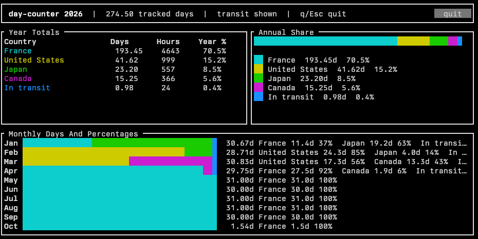

# day-counter

`day-counter` is a Rust terminal app that counts how much time you spent in each
country during one calendar year from a list of flights. It accounts for local
departure and arrival times by converting every timestamp through an explicit
IANA time zone, then displays monthly and yearly percentages in a blit
dashboard.



The dashboard for [`examples/trip.json`](examples/trip.json). Each country has
its own colour, and every bar is split between the countries in proportion to
the time spent in each.

## Install

You need a recent stable Rust toolchain (the crate uses the 2024 edition). From
a checkout of this repository:

```sh
cargo install --path .
day-counter --config examples/trip.json
```

`day-counter` is not on crates.io. Its dashboard is built on
[blit](https://github.com/nicoburniske/blit), which is only distributed as a git
repository, so it is pulled from there at the commit pinned in `Cargo.toml`.

## Input Format

Provide a JSON file with the report settings and flight list:

```json
{
  "year": 2026,
  "initial_country": "France",
  "initial_timezone": "Europe/Paris",
  "include_transit": true,
  "flights": [
    {
      "departure_country": "France",
      "departure_timezone": "Europe/Paris",
      "departure_local": "2026-01-12T09:30",
      "arrival_country": "Japan",
      "arrival_timezone": "Asia/Tokyo",
      "arrival_local": "2026-01-12T19:10"
    },
    {
      "departure_country": "Japan",
      "departure_timezone": "Asia/Tokyo",
      "departure_local": "2026-02-04T23:55",
      "arrival_country": "United States",
      "arrival_timezone": "America/Los_Angeles",
      "arrival_local": "2026-02-04T16:20"
    }
  ],
  "crossings": [
    {
      "country": "Spain",
      "timezone": "Europe/Madrid",
      "local": "2026-03-10T11:30"
    }
  ]
}
```

Land border crossings (car, train, on foot, ...) go in the optional
`crossings` list. Each entry records the moment you entered a country:
`country` and `timezone` describe the country you are entering, and `local` is
the wall-clock time in that time zone when you crossed. The previous country
owns time up to that instant and the new country owns time from it, with no
`In transit` share.

Timestamps are local wall-clock times. Accepted timestamp formats are
`YYYY-MM-DDTHH:MM`, `YYYY-MM-DD HH:MM`, and the same forms with seconds.

JSON keys can use `snake_case` or hyphenated names such as `initial-country`.

IANA time zones are required for accuracy. Country names alone are ambiguous for
countries with multiple time zones, and offsets alone are not enough to handle
DST transitions correctly.

## Counting rules

- The report is limited to one calendar year, January 1 through December 31.
- The initial country owns time from local January 1 00:00 until the first
  flight departure.
- A country owns time from arrival local time until the next departure local
  time.
- Flight duration is shown as `In transit` by default, using the departure time
  zone for monthly grouping.
- Set `"include_transit": false` to drop flight duration from the report.
- A land border crossing switches the country instantly at the crossing time,
  so it never contributes to `In transit`.
- Set `"full_year": true` to force a complete year. The `--full-year` CLI flag
  does the same without editing the file.
- Pass `--start-on YYYY-MM-DD` to only count time from that date on (midnight
  in the initial time zone). Earlier flights and crossings still determine
  where the period starts, but their time is excluded from the report.
- Ambiguous or nonexistent local times during DST transitions are rejected so the
  input can be corrected explicitly.

## Run

```sh
cargo run -- --config examples/trip.json
```

In a normal terminal this opens the blit dashboard. Press `q`, `Esc` or `Ctrl+C`
to quit, or click the `quit` button.

The dashboard needs a Unix terminal. `Esc` and `Ctrl+C` are only recognised by
terminals that speak the kitty keyboard protocol, such as kitty or Ghostty; in
any other terminal, quit with `q` or the button.

The lists scroll with the mouse wheel when they do not fit, so every country is
reachable. Hovering a country highlights its share in every bar; clicking one
pins that highlight until you click it again.

Months with no tracked time are left out of the month list: everything before
`--start-on`, and everything after today when the current year is counted until
now.

For text output:

```sh
cargo run -- --config examples/trip.json --summary
```

If `full_year` is not set, the current year is counted until now and other years
are counted as a full calendar year.

## License

Licensed under either of

- Apache License, Version 2.0 ([LICENSE-APACHE](LICENSE-APACHE) or
  <https://www.apache.org/licenses/LICENSE-2.0>)
- MIT license ([LICENSE-MIT](LICENSE-MIT) or
  <https://opensource.org/licenses/MIT>)

at your option.

Unless you explicitly state otherwise, any contribution intentionally submitted
for inclusion in the work by you, as defined in the Apache-2.0 license, shall be
dual licensed as above, without any additional terms or conditions.
